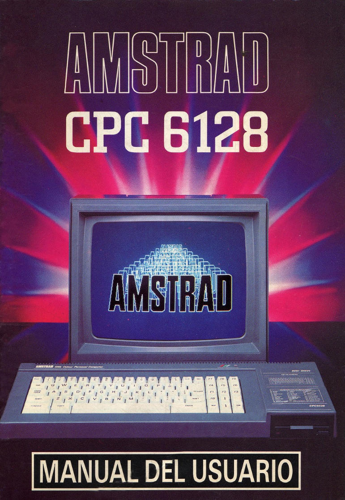

# Amstrad CPC6128 - Manual del usuario

"Remasterización" del manual del usuario del **Amstrad CPC6128** realizada por [sevioptero](https://github.com/sevioptero).

Se han rehecho todos los gráficos, a excepción de los que están dibujados a mano.

Si estás empezando con el Amstrad espero que te sea de utilidad.

Maquetado en html con [mdBook](https://github.com/rust-lang/mdBook) para facilitar su consulta.

[**Amstrad CPC6128 - Manual del usuario**](https://latchdevel.github.io/Amstrad-CPC6128-Manual-del-Usuario/)

