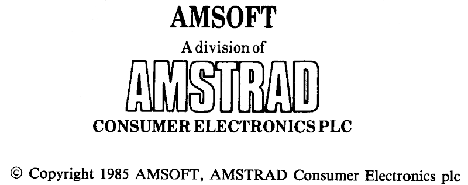

# Introducción 
# AMSTRAD CPC6128
## Sistema integrado de ordenador/disco
## Una evolución lógica

Los dos modelos anteriores de Amstrad, el CPC464 y el CPC664, que tan inmenso éxito han tenido, han constituido la base a partir de la cual hemos desarrollado este nuevo sistema: el CPC6128. Continuando con nuestra norma de compatibilidad, el CPC6128 puede funcionar con los programas escritos para el CPC464 y el CPC664, y además dispone de 64K de RAM adicionales que pueden ser aprovechados por CP/M y otros programas. 

## CP/M Plus
El sistema operativo CP/M Plus (también conocido como CP/M 3.1) proporciona el acceso inmediato a la amplia biblioteca de programas diseñados para CP/M 80. Gracias a los 61K de TPA (área para programas transitorios), cualquier programa de CP/M 80 encuentra espacio más que suficiente para sí mismo y para los datos. CP/M Plus es compatible con CP/M 2.2; no obstante, hemos incluido ambas versiones para permitir que las aplicaciones que hayan sido desarrolladas utilizando funciones del sistema operativo CP/M 2.2 en Amstrad funcionen sin requerir modificación. CP/M Plus está dotado de numerosas funciones que contribuyen a mejorar las prestaciones del sistema; casi todos los programas escritos para CP/M 2.2 pueden aprovechar estas funciones sin conflicto. El sistema CP/M Plus incluye un "emulador de consola" gracias al cual los programas que han sido configurados para adaptarse al método de control de la pantalla de los terminales VT52 y Zenith Z19/Z29 pueden funcionar en el CPC6128 sin necesidad de más adaptación. 

## GSX 
GSX es un sistema de gestión de gráficos, suministrado con esta versión de CP/M Plus, que permite a los programas controlar, mediante instrucciones estándar, la emisión de gráficos a través de la pantalla o de impresoras o plotters. Los programas que utilicen GSX podrán comunicarse con diversos dispositivos gráficos para producir copias en papel de diagramas de barras, gráficas, etc. 

## Dr. LOGO 
El LOGO de Digital Research continúa abriendo caminos nuevos en la enseñanza de la informática; gracias a la memoria adicional del 6128, ha sido posible ampliar la anterior versión de Dr. LOGO (para CP/M 2.2) con nuevas instrucciones. Por supuesto, los programas escritos para la versión antigua son compatibles con la nueva. 

## Discos 
EI CPC664 estableció un punto de referencia para el futuro con su unidad de disco incorporada en la propia máquina. El CPC6128 sigue ofreciendo las ventajas del sistema de disco a un número cada vez mayor de usuarios que demandan las prestaciones de los ordenadores personales a precio de ordenadores domésticos. Los programas que utilizan las funciones más avanzadas de CP/M Plus y GSX no podrán funcionar en los modelos anteriores. Finalmente, el CPC6128 está apoyado por uno de los fabricantes de productos electrónicos de gran consumo más grandes del Reino Unido. Por otra parte, la revista oficial de Amstrad se ha convertido ya en la principal y más fiable fuente de información y noticias para los usuarios de los ordenadores Amstrad. 

## Programas 
El CPC6128 puede ejecutar todos los programas disponibles en disco para los sistemas CPC664 y CPC464/DDI1, y casi todos los disponibles en cinta (conectando un magnetófono de cassettes, por supuesto). Esto significa que el usuario del CPC6128 puede elegir, sin necesidad de espera alguna, entre los muchos programas publicados por Amsoft y otras casas de software. 

<table><tr><td>

El contenido de este manual y el producto en él descrito no pueden ser adaptados ni reproducidos, ni total ni parcialmente, salvo con el  permiso escrito de AMSTRAD plc ("Amstrad").

El producto descrito en este manual, así como los diseñados para ser utilizados con él, están sujetos a desarrollo y mejoras continuas. Toda la información técnica relativa al producto y su utilización (incluida la que figura en este manual) es suministrada por Amstrad de buena fe.  Admitimos, no obstante, que en este manual puede haber errores u omisiones. El usuario puede obtener una lista de correcciones y modificaciones solicitándola a Amstrad o de sus distribuidores. Rogamos a los usuarios que rellenen y envíen a los distribuidores las tarjetas de registro y de garantía.

</td></tr></table>

AMSOFT agradecerá el envío de comentarios y sugerencias relativos a este manual y al producto en él descrito. 

Toda la correspondencia se debe dirigir a 

AMSOFT 
Aravaca, 22 
28040 Madrid  
España  

Toda reparación u operación de mantenimiento de este producto debe ser confiada a los distribuidores autorizados de AMSOFT. Ni AMSOFT ni AMSTRAD pueden aceptar ninguna responsabilidad derivada del daño o pérdida que se pueda ocasionar como resultado de reparaciones efectuadas por personal no autorizado. El objetivo de este manual no es sino servir de ayuda al usuario en la utilización del producto; por consiguiente, AMSTRAD y AMSOFT quedan eximidos de responsabilidad por el daño o pérdida a que pueda dar lugar la utilización de la información aquí publicada o la incorrecta utilización del producto. 

Dr. LOGO, CP/M, CP/M Plus, GSX y DR Graph son marcas registradas de 
Digital Research Inc. 
Z80 es marca registrada de Zilog Inc. 
IBM e IBM PC son marcas registradas de International Business Machines Inc. 
Z19, Z29 y H89 son marcas registradas de Zenith Data Systems, Inc. 
VT52 es marca registrada de Digital Equipment Corp. 
AMSDOS, CPC6128, CPC664, CPC472 y CPC464 son marcas registradas de 
AMSTRAD Consumer Electronics plc 
Edición 1986 
Compilado por Ivor Spital 
Escrito por Ivor Spital, Roland Perry, William Poel, Cliff Lawson; 
con la colaboración de Locomotive Software Ltd 
y con aportaciones de Alexander Martin, David Radisic y Ken Clark 
Traducido del inglés por Emilio Benito Santos 
 
Publicado por AMSTRAD 
 
Edición española producida por 
Vector Ediciones  
AMSTRAD es marca registrada de AMSTRAD Consumer Electronics plc 
Queda estrictamente prohibido utilizar la marca y la palabra AMSTRAD sin la debida autorización 

***

  /  [Índice](0.03.-Contenido.md)  /   [Importante](0.02.-Importante.md) &#9654;