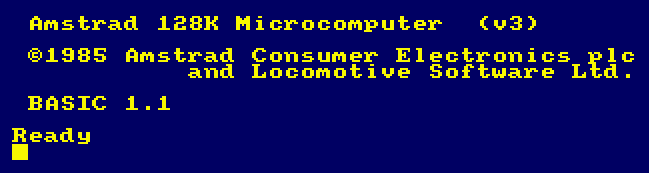

# Capítulo 1. Curso de introducción 

## Parte 1: Instalación y mantenimiento

**Contenido:**

* [Conexión del ordenador a la red](#conexión-del-ordenador-a-la-red).
* [Conexión del ordenador a un monitor](#conexión-del-ordenador-a-un-monitor).
* [Conexión del ordenador a la unidad modulador/fuente de alimentación MP2](#conexión-del-ordenador-a-la-unidad-moduladorfuente-de-alimentación-mp2).
* [Encendido del sistema CPC6128 con GT65 o con CTM644](#encendido-del-sistema-cpc6128-con-gt65-o-con-ctm644).
* [Encendido del sistema CPC6128 con la unidad modulador/fuente de alimentación MP2 ](#encendido-del-sistema-cpc6128-con-la-unidad-moduladorfuente-de-alimentación-mp2)
* [Anomalías en el funcionamiento del sistema](#anomalías-en-el-funcionamiento-del-sistema).
* [Limpieza](#limpieza).

***

El CPC6128 puede ser instalado con: 

1. El monitor de fósforo verde AMSTRAD GT65. 
1. El monitor de color AMSTRAD CTM644. 
1. O la unidad modulador/fuente de alimentación AMSTRAD MP2 conectada a 
    un televisor de color (en UHF). 
### Conexión del ordenador a la red 
El CPC6128 sólo se puede conectar a la red de 220-240V c.a., 50 Hz.

No extraiga ningún tornillo ni trate de abrir la carcasa del ordenador, del monitor ni de la unidad MP2. Lea y respete las advertencias que se dan en la etiqueta de características, que está situada en la cara inferior de la carcasa del ordenador y de la fuente de alimentación: 

<strong>Desconectar cuando no se utilice.</strong> 
    <strong>¡ATENCIÓN!</strong> 
    <strong>No manipular en su interior</strong>

y en la cara posterior de los monitores: 

    <strong>NO ABRIR SIN ANTES DESCONECTAR</strong> 
    <strong>LA TENSIÓN DE RED.</strong>

### Conexión del ordenador a un monitor
(Si va a utilizar su CPC6128 con la unidad MP2, no es necesario que lea esta sección.) 
1. Cerciórese de que el monitor no está conectado a la red. 
1. Conecte el cable que sale de la cara frontal del monitor y termina en una clavija grande (DIN de 6 patillas) al zócalo posterior del ordenador marcado con **MONITOR**.
1. Conecte el cable que sale de la cara frontal del monitor y termina en la clavija más pequeña al zócalo posterior del ordenador marcado con **5V c.c**.
1. Conecte el cable que sale de la cara posterior del ordenador y termina en una clavija pequeña (12V c.c.) al zócalo que hay en la cara frontal del monitor. 

### Conexión del ordenador a la unidad modulador/fuente de alimentación MP2
La MP2 es una unidad opcional que el usuario puede querer adquirir si está utilizando actualmente el CPC6128 con el monitor de fósforo verde GT65. La MP2 permite conectar el CPC6128 a un televisor de color doméstico, para así disfrutar de las posibilidades de color del CPC6128. 

La MP2 se debe colocar inmediatamente a la derecha del CPC6128. 

1. Cerciórese de que la MP2 no está conectada a la red.
1. Conecte el cable de la MP2 que termina en una clavija grande (DIN de 6 patillas) al zócalo posterior del ordenador marcado con **MONITOR**. 
1. Conecte el cable de la MP2 que termina en una clavija pequeña al zócalo posterior del ordenador marcado con **5V c.c**.
1. Conecte el cable que sale de la MP2 y termina en una clavija de antena a la entrada de antena de su televisor. 
1. Conecte el cable que sale de la cara posterior del ordenador y termina en una clavija pequeña (12V c.c.) al zócalo posterior de la MP2. 

### Encendido del sistema CPC6128 con GT65 o con CTM644
(Si va a utilizar su CPC6128 con la unidad MP2, no es necesario que lea esta sección.)

Una vez conectado el sistema según se ha explicado en secciones anteriores, inserte la clavija de red en la toma mural. Para encender el sistema, pulse el botón **ALIMENTACION** que está en la cara frontal del monitor, de modo que quede en posición «**ENC.**». Si este botón está en «**APAG.**», el suministro de corriente al resto del sistema queda interrumpido.

Encienda el ordenador mediante el interruptor deslizante marcado con **ALIMENTACION**, que está en su cara derecha.

En este momento se debe encender el piloto rojo (**ENC.**) que está a la derecha del teclado; en el monitor se verá el siguiente mensaje: 

Para evitar la fatiga visual excesiva, ajuste el control de brillo marcado con **BRILLO** al mínimo necesario para que el texto se vea cómodamente, sin que deslumbre ni resulte borroso. 

El control **BRILLO** se encuentra en la parte inferior de la cara frontal del monitor GT65 y en el lateral derecho del CTM644. 

En el caso del GT65, puede ser necesario ajustar los controles de contraste (**CONTRASTE**) y de fijación del cuadro vertical (**SINCRO. VERT.**), que están en el panel frontal. 

El mando de **CONTRASTE** se debe poner en el mínimo compatible con la cómoda visualización de los textos. 

### Encendido del sistema CPC6128 con la unidad modulador/fuente de alimentación MP2 

Una vez conectado el sistema según se ha explicado en secciones anteriores, inserte la clavija de red en la toma mural. Encienda el ordenador mediante el interruptor deslizante que está en su lateral derecho. 

En este momento se debe encender el piloto rojo que está en el centro del teclado. Ahora debe sintonizar el televisor para recibir las señales del ordenador. 

Si su televisor tiene un selector de canales de botonera, pulse el botón correspondiente a un canal no utilizado. Ajuste el mando de sintonía siguiendo las instrucciones del manual del televisor (si dispone de un dial de sintonía, pruebe en las proximidades del canal 36) hasta obtener la siguiente imagen: 

Trate de conseguir la máxima nitidez posible. El texto aparecerá en color amarillo dorado sobre fondo azul. 

Si el televisor tiene un selector de canales rotatorio, gírelo hasta que pueda ver la imagen y ésta sea estable (canal 36, aproximadamente). 

### Anomalías en el funcionamiento del sistema
**Al pulsar el interruptor de alimentación no se ilumina la pantalla**

- Apague el interruptor pulsándolo por segunda vez.
- Desconecte el ordenador de la toma mural.
- Enchufe en ella una lámpara que usted sepa que funciona para comprobar que llega corriente.
- Desconecte la impresora.
- Si tiene instalado un interfaz RS232, desconéctelo.
- Vuelva a enchufar el ordenador en la toma mural; si hay algún interruptor que controle el paso de corriente al enchufe, enciéndalo.
- Finalmente, vuelva a pulsar el interruptor de alimentación. 

Si el problema persiste, consulte a su distribuidor. 

**No se puede introducir el disco en la unidad**
- Compruebe que no hay otro disco en la unidad. Si lo hay, se verá la etiqueta. En tal caso pulse el botón de eyección para extraerlo. 
- Cerciórese de que no está intentando introducir el disco al revés (véase la sección 3.1.2). 

### Limpieza
Para la limpieza de la pantalla y el teclado recomendamos el uso de espumas antiestáticas en aerosol. **En ningún caso se puede utilizar productos limpiadores espiritosos.** 

Finalmente, asegúrese de que ha tenido en cuenta las advertencias que hemos hecho al principio de este manual, en la sección titulada [IMPORTANTE](0.02.-Importante.md): 

* [NOTAS DE INSTALACIÓN](0.02.-Importante.md#notas-de-instalación) 1, 2, 4, 5, 6, 7 y 8.
* [NOTAS DE OPERACIÓN](0.02.-Importante.md#notas-de-operación) 1. 

***

&#9664; [Capítulo 1. Curso de introducción](1.00.-Capítulo-1.-Curso-de-introducción.md)   /  [Índice](0.03.-Contenido.md)  /   [Capítulo 1. Parte 2: Conexión de los periféricos](1.02.-Conexión-de-los-periféricos.md) &#9654;