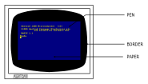

# Capítulo 1. Curso de introducción 

## Parte 8: Introducción a los modos de pantalla, colores y gráficos

**Contenido:**
* [Colores](#colores).
* [La pantalla](#la-pantalla).
* [Colores parpadeantes](#colores-parpadeantes).
* [Gráficos](#gráficos).
* [LOCATE](#locate).
* [FRAME](#frame).
* [PLOT](#plot).
* [DRAW](#draw).
* [MOVE](#move).
* [Circunferencias](#circunferencias).
* [Dibujo de una circunferencia](#dibujo-de-una-circunferencia).
* [ORIGIN](#origin).
* [FILL](#fill).
* [Otros detalles](#otros-detalles).

***

El AMSTRAD CPC6128 puede funcionar en tres modos de pantalla: modo 0, modo 1 y modo 2.

Al encenderlo, el ordenador selecciona automáticamente el modo 1.

Para apreciar las diferencias entre los tres modos, encienda el ordenador y pulse la tecla del **1**. Manténgala pulsada hasta que se hayan llenado dos líneas de pantalla. Si cuenta los unos, observará que hay 40 en cada línea. Esto quiere decir que en modo 1 la pantalla tiene 40 columnas. Pulse **[RETURN]**: el ordenador responderá con un mensaje de **Syntax error**, pero no se preocupe; ésta es una forma rápida de obtener nuevamente el mensaje **Ready**, que indica que el ordenador está preparado para recibir nuestras instrucciones. 

Escriba ahora: 

```basic
mode 0 [RETURN]
```

Observará que ahora los caracteres son más grandes. Pulse otra vez la tecla del **1** y no la suelte hasta que se hayan llenado dos líneas de la pantalla. Compruebe que ahora hay 20 unos por línea. Esto significa que en modo 0 la pantalla tiene 20 columnas. Pulse nuevamente **[RETURN]** y luego escriba: 

```basic
mode 2 [RETURN]
```

Observe que ahora los caracteres son muy pequeños. Puede comprobar que en modo 2 la pantalla tiene 80 columnas.

Resumiendo, 

| Modo | Número de columnas |
| :--: | :----------------: |
|  0   |         20         |
|  1   |         40         |
|  2   |         80         |

Finalmente, vuelva a pulsar **[RETURN]**. 

### Colores

Este ordenador puede manejar 27 colores. En el monitor de fósforo verde (GT65) aparecen como distintas gradaciones de verde. Si usted adquirió el sistema con el monitor GT65, en cualquier momento puede comprar la unidad modulador/fuente de alimentación MP2, con la que podrá disfrutar de los colores del ordenador conectándolo a un televisor doméstico. 

* En modo 0 se puede visualizar simultáneamente 16 de los 27 colores disponibles.
* En modo 1 se puede visualizar simultáneamente 4 de los 27 colores.
* En modo 2 se puede visualizar simultáneamente 2 de los 27 colores.

Se puede controlar los colores del borde, del papel (fondo) y de la pluma (trazo) independientemente unos de otros.

Los 27 colores disponibles son los relacionados en la tabla 1, en la que incluimos también los números de referencia para la instrucción **INK** (tinta). 

Para mayor comodidad, esta tabla aparece también en la carcasa del ordenador, al lado derecho. 

| Número de tinta | Color           | Número de tinta | Color          | Número de tinta | Color            |
| :-------------: | --------------- | :-------------: | -------------- | :-------------: | ---------------- |
|        0        | Negro           |        9        | Verde          |       18        | Verde intenso    |
|        1        | Azul            |       10        | Cyan           |       19        | Verde mar        |
|        2        | Azul intenso    |       11        | Azul celeste   |       20        | Cyan intenso     |
|        3        | Rojo            |       12        | Amarillo       |       21        | Verde lima       |
|        4        | Magenta         |       13        | Blanco         |       22        | Verde pastel     |
|        5        | Malva           |       14        | Azul pastel    |       23        | Cyan pastel      |
|        6        | Rojo intenso    |       15        | Anaranjado     |       24        | Amarillo intenso |
|        7        | Morado          |       16        | Rosado         |       25        | Amarillo pastel  |
|        8        | Magenta intenso |       17        | Magenta pastel |       26        | Blanco intenso   |

**Tabla 1**. Números de tinta y colores asociados. 

Como hemos dicho, el ordenador se pone automáticamente en modo 1 al encenderlo. Para volver a modo 1 estando en cualquier otro, basta con escribir: 

```basic
mode 1 [RETURN]
```

### La pantalla

El borde (**BORDER**) es el área que rodea el papel (**PAPER**). (Cuando se enciende el ordenador, el borde y el papel son ambos azules.) Los caracteres que escribimos en la pantalla sólo puede estar en la región interior al borde. El *papel* es el fondo sobre el que la *pluma* (**PEN**) escribe los caracteres. 



Vamos a explicar como se realiza la selección de los colores. 

Cuando se enciende o reinicializa el ordenador, éste selecciona automáticamente el color número 1 para el borde. Como puede comprobar en la tabla 1, el color número 1 es el azul. El color del borde se puede cambiar mediante la orden **BORDER** seguida del número del color deseado. Por ejemplo, escriba: 

```basic
border 13 [RETURN]
```

Esto es fácil, pero en el interior de la pantalla las cosas son algo más complicadas: 

Cuando se enciende o reinicializa la máquina, el número de papel seleccionado automáticamente es el 0, y el de la pluma es el 1. Esto no quiere decir que los colores correspondientes sean los que figuran en la tabla anterior con los números 0 y 1.

Lo que ocurre es que el 0 y el 1 son números de papel y de pluma, *no* números de tinta. Vamos a explicarnos. Supongamos que tenemos en nuestra mesa cuatro plumas, numeradas del 0 al 3, y 27 tinteros, numerados del 0 al 26. Es evidente que cuando decimos "pluma número 1" no necesariamente estamos refiriéndonos al color número 1. La pluma número 1 puede estar cargada con tinta de cualquier color; de hecho, podemos tener las cuatro plumas cargadas con la misma tinta.

Pues bien, algo similar ocurre en el ordenador. Con la instrucción **PEN** (pluma) podemos elegir la pluma con la que vamos a escribir; la instrucción **INK** (tinta) nos permite "cargar" esa pluma con tinta del color deseado. 

Recordando que estamos en modo 1 (40 columnas), consulte la tabla 2 y comprobará que la pluma número 1 está cargada inicialmente con tinta de color 24. Pero el color 24 es, como podemos ver en la tabla 1, amarillo intenso: el color con que se escriben los caracteres cuando acabamos de encender el ordenador. 

| Número de papel/pluma | Color de tinta Modo 0 | Color de tinta Modo 1 | Color de tinta Modo 2 |
| :-------------------: | :-------------------: | :-------------------: | :-------------------: |
|           0           |           1           |           1           |           1           |
|           1           |          24           |          24           |          24           |
|           2           |          20           |          20           |           1           |
|           3           |           6           |           6           |          24           |
|           4           |          26           |           1           |           1           |
|           5           |           0           |          24           |          24           |
|           6           |           2           |          20           |           1           |
|           7           |           8           |           6           |          24           |
|           8           |          10           |           1           |           1           |
|           9           |          12           |          24           |          24           |
|          10           |          14           |          20           |           1           |
|          11           |          16           |           6           |          24           |
|          12           |          18           |           1           |           1           |
|          13           |          22           |          24           |          24           |
|          14           |     Parpadeo 1,24     |          20           |           1           |
|          15           |    Parpadeo 16,11     |           6           |          24           |

**Tabla 2**. Asignación inicial de tintas a los papeles y las plumas. 

Las relaciones entre papel, pluma y tinta no son fijas. Los valores que se muestran en la tabla 2 son los seleccionados automáticamente en el momento de encender la máquina. Se los puede cambiar mediante la instrucción **INK** (tinta). Esta instrucción va seguida de dos números (parámetros). El primero es el número de papel o de pluma que vamos a cargar; el segundo es el color con que vamos a cargarlo. Los parámetros van separados por una coma. 

Puesto que estamos utilizando la pluma número 1, vamos a cambiar el color de tinta correspondiente: la cargaremos con tinta de color anaranjado. Escriba: 

```basic
ink 1,15 [RETURN]
```

Los caracteres han cambiado instantáneamente de color. 

También vamos a cambiar el color del fondo mediante la instrucción **INK**. Sabemos que el número de papel seleccionado al encender la máquina es el 0; vamos a cambiar el color a verde (color número **9**) escribiendo: 

```basic
ink 0,9 [RETURN]
```

Ahora vamos a cambiar de pluma. Escriba: 

```basic
pen 3 [RETURN]
```

El color de los caracteres ya escritos no ha cambiado. Esta instrucción afecta solamente a los que escribamos a continuación. En este momento estamos utilizando la pluma número 3. Como puede comprobar en las tablas 1 y 2, la tinta con que esta pluma está cargada inicialmente es la de color número 6 (rojo intenso). Para cambiarla a rosado escriba: 

```basic
ink 3,16 [RETURN]
```

Recuerde que el 3 es el color de la pluma (seleccionado con la anterior instrucción **pen 3**) y que el 16 es el color de la tinta con que la cargamos (rosado). 

Cambiemos ahora de papel. Cuando lo hagamos, el anterior color de fondo no cambiará, porque ese color ha sido impreso con otro papel. Escriba lo siguiente: 

```basic
paper 2 [RETURN]
```

Consultando nuevamente las tablas 1 y 2, compruebe que el color inicialmente asignado al papel número 2 es cyan intenso. Cámbielo a negro escribiendo: 

```basic
ink 2,0 [RETURN]
```

En este momento, en la pantalla tenemos caracteres escritos por las plumas 1 y 3, sobre fondos de papel números 0 y 2. También se puede cambiar el color de la tinta de una pluma o de un papel que no estén siendo utilizados. Por ejemplo, escriba la orden: 

```basic
ink 1,2 [RETURN]
```

que cambia el color de todos los caracteres que habíamos escrito antes con la pluma número 1. 

Escriba: 

```basic
cls [RETURN]
```

para borrar la pantalla. 

El lector ya debería ser capaz de hacer que el ordenador vuelva a los colores iniciales (borde y fondo azul y caracteres amarillos) utilizando las instrucciones **BORDER**, **PAPER**, **PEN** e **INK**. Inténtelo. Si no lo consigue, reinicialice el ordenador con **[CONTROL]**  **[MAYS]**  **[ESC]**. 

### Colores parpadeantes

Es posible hacer que una tinta cambie intermitentemente de color. Para ello se debe añadir otro número a la instrucción **INK** que asigna tintas a la pluma utilizada.

Vamos a hacer que los caracteres que escribamos alternen entre los colores blanco intenso y rojo intenso. Reinicialice la máquina con **[CONTROL]**  **[MAYS]**  **[ESC]**  y escriba lo siguiente: 

```basic
ink 1,26,6 [RETURN]
```

En este caso el **1** es el número de la pluma, el **26** es el del color blanco intenso y el **6** es el del segundo color, rojo intenso.

El mismo efecto de parpadeo se puede dar a los colores del fondo, para lo cual se añade un segundo número de color a la instrucción **INK** que asigna tintas al papel actual. Para hacer que el color del fondo alterne entre verde y amarillo intenso escriba: 

```basic
ink 0,9,24 [RETURN]
```

En este caso **0** es el número del papel, **9** es el número del color verde y **24** es el número del segundo color, el amarillo intenso.

Reinicialice el ordenador con **[CONTROL]**  **[MAYS]**  **[ESC]**. 

Observe en la tabla 2 que en modo 0 hay dos números de pluma y dos números de papel, el **14** y el **15**, que tienen asignadas tintas parpadeantes. Es decir, sus correspondientes tintas están preprogramadas con un color adicional.

Escriba lo siguiente: 

```basic
mode O [RETURN]
pen 15 [RETURN]
```

y verá en la pantalla la palabra **Ready** parpadeando entre azul celeste y rosado. Escriba ahora: 

```basic
paper 14 [RETURN]
cls 
```

El texto continúa parpadeando como antes, pero además el fondo ha empezado a alternar entre los colores amarillo y azul. 

Los números de pluma y de papel **14** y **15** pueden ser reprogramados, mediante la adecuada instrucción **INK**, para que parpadeen con otras tintas o bien para asignarles un color fijo. 

Finalmente, se puede hacer parpadear el borde sin más que especificar un segundo número de color en la instrucción **BORDER**. Escriba: 

```basic
border 6,9 [RETURN]
```

El borde está parpadeando entre los colores rojo intenso y verde. Observe que al borde se le puede asignar uno o dos colores cualesquiera de los 27 disponibles, independientemente del modo en que esté la pantalla (0, 1 o 2).

Reinicialice el ordenador con **[CONTROL]**  **[MAYS]**  **[ESC]**.

Introduzca y ejecute el siguiente programa, que demuestra los colores disponibles. 

```basic
10 MODE 0 [RETURN]
20 velocidad=600: REM establece velocidad del programa [RETURN]
30 FOR b=0 TO 26 [RETURN]
40 LOCATE 1,12 [RETURN]
50 BORDER b [RETURN]
60 PRINT "color del borde:";b [RETURN]
70 FOR t=1 TO velocidad [RETURN]
80 NEXT t,b [RETURN]
90 CLG [RETURN]
100 FOR p=0 TO 15 [RETURN]
110 PAPER p [RETURN]
120 PRINT "papel:";p [RETURN]
130 FOR n=0 TO 15 [RETURN]
140 PEN n [RETURN]
150 PRINT "pluma:";n [RETURN]
160 NEXT n [RETURN]
170 FOR t=1 TO velocidad*2 [RETURN]
180 NEXT t,p [RETURN]
190 MODE 1 [RETURN]
200 BORDER 1 [RETURN]
210 PAPER 0 [RETURN]
220 PEN 1 [RETURN]
230 INK 0,1 [RETURN]
240 INK 1,24 [RETURN]
run  [RETURN]
```

<table>
<tr><td>
<b>OBSERVACIÓN MUY IMPORTANTE</b><br />
En este programa, así como en otros capítulos y listados de este manual, las palabras clave de BASIC aparecen en mayúsculas, pues el ordenador convierte automáticamente minúsculas a mayúsculas cuando se le pide que haga un listado del programa (con <b>LIST</b>). En general, es preferible escribir las instrucciones en minúsculas; esto ayudará más tarde a detectar errores, ya que las palabras clave de BASIC que contengan algún error no serán convertidas a mayúsculas. 
<br />
En lo que resta de este "Curso de introducción" daremos los listados indistintamente en mayúsculas y minúsculas, para que usted se familiarice con esta característica de BASIC. 
<br />
Los nombres de las variables, tales como <b>x</b> o <b>a$</b>, <i>no</i> son convertidos a mayúsculas al listar el programa. Sin embargo, el ordenador reconoce las variables tanto si están en mayúsculas como si están en minúsculas, de hecho, para el ordenador <b>x</b> es la misma variable que <b>X</b>. 
</td></tr>
</table>


<table>
<tr><td>
<strong>Atención</strong><br />
A partir de ahora no vamos a seguir recordándole que debe pulsar <strong>[RETURN]</strong> al terminar de escribir cada línea de programa y cada orden directa, pues suponemos que usted ya está suficientemente habituado a hacerlo. 
</td></tr>
</table>


### Gráficos

En la memoria del ordenador está pregrabado el diseño de cierto número de caracteres. Para escribirlos en la pantalla necesitamos la palabra clave: 

```basic
chr$( ) 
```

Dentro de los paréntesis se pone el número del carácter, que debe estar en el margen de 32 a 255.

Reinicialice el ordenador con **[CONTROL]**  **[MAYS]**  **[ESC]** y escriba lo siguiente: 

```basic
print chr$(250)
```

No olvide pulsar **[RETURN]**. En la pantalla ha aparecido el carácter número **250**, que es la figura de un hombre caminando hacia la derecha. 

Para ver todos los caracteres y símbolos, junto con su número correspondiente, introduzca y ejecute el siguiente programa (recuerde que debe pulsar **[RETURN]** al final de cada línea): 

```basic
10 for n=32 to 255
20 print n;chr$(n);
30 next n
run 
```

Todos estos caracteres y números figuran en el capítulo [Para su referencia](7.00.-Capítulo-7.-Para-su-referencia.md).

### LOCATE

Esta instrucción sirve para colocar el cursor en un lugar especificado de la pantalla. A menos que se lo mueva con una instrucción **LOCATE**, el punto de partida del cursor es el extremo superior izquierdo de la pantalla, punto de coordenadas **1,1** (en el sistema de coordenadas **x**, **y**, donde **x** es la posición horizontal e **y** es la vertical). En modo 1 hay 40 columnas y 25 filas (o líneas). Así, para colocar el cursor en el centro de la primera línea, tendremos que utilizar **20,1** como coordenadas **x**, **y**. 

Teclee lo siguiente (sin olvidar pulsar **[RETURN]** al final de cada línea): 

```basic
mode 1 ... borra la pantalla y lleva el cursor al extremo superior izquierdo 

10 locate 20,1
20 print chr$(250)
run 
```

Para comprobar que el carácter está en la primera línea, cambiemos el color del borde: 

```basic
border 0
```

El borde es ahora negro y podemos ver que el hombrecillo está en el centro de la línea superior. 

En modo 0 sólo hay 20 columnas, pero las mismas 25 líneas. Si ahora escribe: 

```basic
mode 0
run
```

verá que el hombre se ha ido al extremo superior derecho de la pantalla. Esto ha ocurrido porque la coordenada x = 20 es la última columna en modo 0. Escriba: 

```basic
mode 2
run
```

Vuelva a modo 1 con: 

```basic
mode 1
```

Ahora pruebe usted con diferentes posiciones en **locate** y diferentes números en **chr$( )**.

Por ejemplo, escriba: 

```basic
locate 20,12:print chr$(240)
```

y verá una flecha en el centro de la pantalla. Observe que en esta instrucción: 

* **20** es la coordenada x (horizontal) (margen: 1 a 40) 
* **12** es la coordenada y (vertical) (margen: 1 a 25) 
* **240** es el número del carácter (margen: 32 a 255)

Para mover el carácter 250 de izquierda a derecha de la pantalla, escriba lo siguiente: 

```basic
10 CLS
20 FOR x=1 TO 39
30 LOCATE x,20
50 PRINT CHR$(250)
60 NEXT x
70 GOTO 10
run 
```

Pulse **[ESC]** dos veces para abandonar el programa.

Si queremos borrar el carácter recién escrito antes de escribir el siguiente, debemos hacer 

```basic
50 print " ";chr$(250)
```

(Esta nueva línea 50 reemplaza automáticamente la que teníamos antes.) Escriba: 

```basic
run
```

### FRAME

Para mejorar la ilusión de movimiento del carácter por la pantalla, añada al programa anterior la siguiente línea:

```basic
40 frame
```

La instrucción **FRAME** sincroniza el movimiento de objetos por la pantalla con la frecuencia a la que se envían las imágenes al monitor. La explicación es demasiado técnica, pero basta con que recordemos que esta instrucción se debe utilizar siempre que queramos mover objetos por la pantalla.

Este programa se puede mejorar introduciendo pausas y utilizando un símbolo distinto para el retroceso.

Escriba:

```basic
list
```

y añada siguientes líneas:

```basic
70 FOR n=1 TO 300:NEXT n
80 FOR x=39 TO 1 STEP -1
90 LOCATE x,20
100 FRAME
110 PRINT CHR$(251); " "
120 NEXT x
130 FOR n=1 TO 300:NEXT n
140 GOTO 20
run
```

### PLOT

La instrucción **PLOT** es análoga a **LOCATE**, pero controla la posición del cursor gráfico y utiliza un sistema de coordenadas distinto, en el que las distancias se miden en *pixels* (un pixel, o *punto gráfico*, es la mínima área de la pantalla controlable individualmente). 

El cursor gráfico es invisible, y distinto en todos los aspectos del cursor de texto. 

La pantalla se divide en 640 puntos en horizontal por 400 en vertical. Las coordenadas **x**, **y** se toman con respecto al extremo inferior izquierdo de la pantalla, que es el punto de coordenadas **0,0**. A diferencia de lo que ocurría con **LOCATE**, las coordenadas de este sistema no dependen del modo de pantalla (0, 1 o 2). 

Para comprobarlo, reinicialice el ordenador con **[CONTROL]**  **[MAYS]**  **[ESC]** y escriba:

```
plot 320,200
```

Observe el punto que ha aparecido en el centro de la pantalla. 

Hagamos lo mismo en modo 0: 

```basic
mode 0
plot 320,200
```

El punto sigue estando en el centro de la pantalla, pero es más grande. Para ver el efecto en modo 2 escriba: 

```
mode 2
plot 320,200
```

Como era de esperar, el punto sigue centrado, pero es mucho más pequeño.

Dibuje unos cuantos puntos en diversos lugares de la pantalla y en modos distintos para familiarizarse con esta instrucción. Cuando haya terminado, escriba: 

```basic
mode 1
```

para volver a modo 1 y borrar la pantalla. 

### DRAW

Reinicialice la máquina con **[CONTROL]**  **[MAYS]**  **[ESC]**. La instrucción **DRAW** dibuja una recta a partir de la posición actual del cursor gráfico. Para verla en acción, dibuje un rectángulo con el siguiente programa: 

```basic
5 cls
10 plot 10,10
20 draw 10,390
30 draw 630,390
40 draw 630,10
50 draw 10,10
60 goto 60
run 
```

En la línea 10 la instrucción **PLOT** coloca el cursor en el punto de partida deseado. A continuación, las instrucciones **DRAW** van dibujando segmentos de recta: hacia arriba, hacia la derecha, etc. 

Pulse **[ESC]** dos veces para abandonar el programa.

(Observe la línea 60 de este programa. Esta línea establece un bucle infinito, del que sólo se sale deteniendo el programa. Una instrucción de este tipo es útil cuando se quiere evitar que el ordenador exhiba el mensaje **Ready** al terminar el programa.) 

Añada al programa las siguientes líneas, las cuales dibujan un segundo rectángulo dentro del anterior: 

```
60 plot 20,20
70 draw 20,380
80 draw 620,380
90 draw 620,20
100 draw 20,20
110 goto 110
run 
```

Pulse **[ESC]** dos veces para detener el programa. 

### MOVE

Esta instrucción funciona igual que **PLOT** en cuanto a llevar el cursor gráfico a la posición especificada, pero *no* dibuja el punto. 

Escriba: 

```basic
cls
move 639,399 
```

Aunque no podamos verlo, hemos llevado el cursor al extremo superior derecho de la pantalla. 

Para demostrarlo, vamos a dibujar una recta desde ese punto hasta el centro de la pantalla.

Escriba: 

```basic
draw 320,200
```

### Circunferencias

Las circunferencias se pueden dibujar punto a punto o con trazo continuo. Una forma de dibujar una circunferencia consiste en dibujar puntos en las posiciones correctas. En la figura siguiente se ilustra cómo se calculan las coordenadas **x**, **y** de un punto **p** de la circunferencia. Las fórmulas son: 

* x = 190\*cos(a)
* y = 190\*sin(a)


### Dibujo de una circunferencia

En los programas anteriores hemos referido todos los dibujos al extremo inferior izquierdo de la pantalla. Si queremos que nuestra circunferencia quede centrada en la pantalla, debemos situar su centro en el punto de coordenadas **320**,**200**, y luego sumar a estos valores los dados por las fórmulas anteriores. 

El siguiente programa dibuja punto a punto una circunferencia: 

```basic
new 
10 CLS
20 DEG
30 FOR a=1 TO 360
40 MOVE 320,200
50 PLOT 320+190*COS(a),200+190*SIN(a)
60 NEXT
run 
```

Observe que hemos dado la orden **NEW** antes de introducir el programa. Esta orden hace que el ordenador borre el programa que en ese momento tenga en la memoria (de forma similar a lo que ocurre cuando se pulsa **[CONTROL]**  **[MAYS]**  **[ESC]**). Sin embargo, la pantalla no se borra. 

El radio de la circunferencia se puede reducir poniendo en lugar de 190 un número menor de pixels.

Para ver el efecto de dibujar la circunferencia de otra forma (en radianes), borre la línea 20 escribiendo: 

En lugar de punto a punto, podemos dibujar la circunferencia con trazo continuo. Modifique la línea 50 para poner **draw** en lugar de **plot**. La línea será entonces: 

```basic
50 draw 320+190*cos(a),200+190*sin(a)
```

Pruebe esta modificación con la línea 20 y sin ella.

Observe que en la línea 60 de este programa hemos puesto **NEXT** en lugar de **NEXT** a. En efecto, se puede omitir el nombre de la variable, pues el ordenador se encarga de averiguar a qué **FOR** corresponde cada **NEXT**. No obstante, en los programas en los que haya muchos bucles **FOR ... NEXT**, puede ser conveniente poner los nombres de las variables después de **NEXT** para que el programa sea más inteligible cuando se lo esté corrigiendo o estudiando. 

### ORIGIN

En el programa anterior utilizábamos la instrucción **MOVE** para establecer el centro de la circunferencia y luego sumábamos a las coordenadas del centro las coordenadas de los puntos de la circunferencia. Podemos evitar esas sumas si redefinimos la posición del origen de coordenadas con la instrucción **ORIGIN**. El ordenador entenderá las coordenadas que se le suministren a continuación como referidas al nuevo origen. Escriba lo siguiente: 

```basic
new
10 cls
20 for a=1 to 360
30 origin 320,200
40 plot 190*cos(a),190*sin(a)
50 next 
run
```

El siguiente programa dibuja cuatro circunferencias más pequeñas: 

```basic
new
10 CLS
20 FOR a=1 TO 360
30 ORIGIN 196,282
40 PLOT 50*COS(a),50*SIN(a)
50 ORIGIN 442,282
60 PLOT 50*COS(a),50*SIN(a)
70 ORIGIN 196,116
80 PLOT 50*COS(a),50*SIN(a)
90 ORIGIN 442,116
100 PLOT 50*COS(a),50*SIN(a)
110 NEXT
run 
```

Otra forma de dibujar la circunferencia (con trazo continuo) es la siguiente: 

```basic
new
10 MODE 1
20 ORIGIN 320,200
30 DEG
40 MOVE 0,190
50 FOR a=0 TO 360 STEP 10
60 DRAW 190*SIN(a),190*COS(a)
70 NEXT
run 
```

En este caso se van dibujando pequeños segmentos de recta, de un punto al siguiente de la circunferencia. Este método es mucho más rápido que el de dibujo punto a punto.

Observe una vez más el efecto de la instrucción **DEG**: suprima la línea 30 y ejecute el programa.

### FILL

La instrucción **FILL** (rellenar) se utiliza para rellenar una región de la pantalla que esté delimitada por gráficos o por los bordes de la pantalla.

Reinicialice la máquina con **[CONTROL]** **[MAYS]** **[ESC]** y luego escriba: 

```basic
new
10 cls
29 move 29,20
30 draw 620,20
40 draw 310,380
50 draw 20,20
run
```

En la pantalla ha aparecido un triángulo. Lleve el cursor gráfico al centro de la pantalla con la orden 
```basic
mode 320,200
```

Vamos a utilizar la instrucción **FILL** seguida de un número de pluma, por ejemplo el **3**, para rellenar con la tinta de la pluma especificada el recinto cerrado en que se encuentra el cursor. Escriba lo siguiente: 

```basic
fill 3
```

Lleve el cursor al exterior del triángulo con la orden 

```basic
move 0,0
```

Observe qué ocurre cuando escriba: 

```basic
fill 2
```

El ordenador ha usado la pluma número **2** para rellenar la zona delimitada por el dibujo y los bordes de la pantalla. 

Modifique ahora el programa escribiendo la líneas siguientes y vea qué ocurre: 

```basic
50 draw 50,50
60 move 320,200
70 fill 3
run
```

La tinta "rezuma" por la ranuras.

Veámoslo con otro ejemplo. Rellenemos una circunferencia dibujada punto a punto: 

```basic
new
10 CLS
20 FOR a=1 TO 360
30 ORIGIN 320,200
40 PLOT 190*COS(a),190*SIN(a)
50 NEXT
60 MOVE -188,0
70 FILL 3
run 
```

Pruebe ahora con: 

```basic
new
10 MODE 1
20 ORIGIN 320,200
30 DEG
40 MOVE 0,190
50 FOR d=0 TO 360 STEP 10
60 DRAW 190*SIN(d),190*COS(d)
70 NEXT
80 MOVE –188,0
90 FILL 3
run
```

Para hacer que el borde del círculo sea invisible, dibujamos la circunferencia con tinta del mismo color que la del papel. Añada la siguiente línea: 

```basic
45 GRAPHICS PEN 2:INK 2,1
run
```

La instrucción **GRAPHICS PEN** selecciona la pluma que haya de ser utilizada para dibujar gráficos. La instrucción **INK** especifica el color de tinta para esa pluma, que en este caso coincide con el color del papel (color número 1). 

Finalmente, introduzca y pruebe el siguiente programa: 

```basic
new
10 MODE 0:BORDER 13
20 MOVE 0,200:DRAW 640,200
30 FOR x=80 TO 560 STEP 80
40 MOVE x,0: DRAW x,400
50 NEXT:MOVE -40,300
60 FOR c=0 TO 7
70 MOVER 80,0:FILL c
80 MOVER 0,-200:FILL c+8
90 MOVER 0,200:NEXT
100 GOTO 100
run
```

También se puede cambiar los colores de las zonas rellenadas: 

```basic
100 SPEED INK 30,30
110 BORDER RND*26,RND*26
120 INK RND*15,RND*26,RND*26
130 FOR t=1 TO 500:NEXT:GOTO 110
run 
```

### Otros detalles 
En la sección [Dicho gráficamente](9.02.-Más-en-concreto-sobre-el-CPC6128.md#dicho-gráficamente), del capítulo titulado [Cuando usted guste](9.00.-Capítulo-9.-Cuando-usted-guste.md), daremos una explicación más detallada de los gráficos del CPC6128.

Para concluir esta sección, le ofrecemos unos programas de demostración de gráficos que incorporan muchas instrucciones que el lector ya debería entender. Todos ellos dibujan figuras en la pantalla continuamente. 

```basic
10 BORDER 0:GRAPHICS PEN 1
20 m=CINT(RND*2):MODE m
30 i1=RND*26:i2=RND*26
40 IF ABS(i1-i2)<10 THEN 30
50 INK 0,i1:INK 1,i2
60 s=RND*5+3:ORIGIN 320,-100
70 FOR x=-1000 TO 0 STEP s
80 MOVE 0,0:DRAW x,300:DRAW 0,600
90 MOVE 0,0:DRAW -x,300:DRAW 0,600
100 NEXT:FOR t=1 TO 2000:NEXT:GOTO 20
run
```


```basic
10 MODE 1:BORDER 0:PAPER 0
20 GRAPHICS PEN 2:INK 0,0:i=14
30 EVERY 2200 GOSUB 150
40 indicador=0:CLG
50 INK 2,14+RND*12
60 b%=RND*5+1
70 c%=RND*5+1
80 ORIGIN 320,200
90 FOR a=0 TO 1000 STEP PI/30
100 x%=100*COS(a)
110 MOVE x%,y%
120 DRAW 200*COS(a/b%),200*SIN(a/c%)
130 IF indicador=1 THEN 40
140 NEXT
150 indicador=1:RETURN
run
```


```basic
10 MODE 1:BORDER 0:DEG
20 PRINT "Por favor, espere"
30 FOR n=1 to 3
40 INK 0,0:INK 1,26:INK 2,6:INK 3,18
50 IF n=1 THEN sa=120
60 IF n=2 THEN sa=135
70 IF n=3 THEN sa=150
80 IF n=1 THEN ORIGIN 0,-50,0,640,0,400 ELSE ORIGIN 0,0,0,640,0,400
90 DIM cx(5),cy(5),r(5),lc(5)
100 DIM np(5)
110 DIM px%(5,81),py%(5,81 )
120 st=1:cx(1)=320:cy(1)=200:r(1)=80
130 FOR st=1 TO 4
140 r(st+1)=r(st)/2
150 NEXT st
160 FOR st=1 TO 5
170 lc(st)=0:np(st)=0
180 np(st)=np(st)+1
190 px%(st,np(st))=r(st)*SIN(lc(st))
200 py%(st,np(st))=r(st)*COS(lc(st))
210 lc(st)=lc(st)+360/r(st)
220 IF lc(st)<360 THEN 180
230 px%(st,np(st)+1)=px%(st,1)
240 py%(st,np(st)+1)=py%(st,1)
250 NEXT st
260 CLS:cj=REMAIN(1):cj=REMAIN(2)
270 cj=REMAIN(3):INK 1,2:st=1
280 GOSUB 350
290 LOCATE 1,1
300 EVERY 25,1 GOSUB 510
310 EVERY 15,2 GOSUB 550
320 EVERY 5,3 GOSUB 590
330 ERASE cx,cy,r,lc,np,px%,py%:NEXT
340 GOTO 340
350 cx%=cx(st):cy%=cy(st):lc(st)=0
360 FOR x%=1 TO np(st)
370 MOVE cx%, cy%
380 DRAW cx%+px%(st,x%),cy%+py%(st,x%),1+(st MOD 3)
390 DRAW cx%+px%(st,x%+1),cy%+py%(st,x%+1),1+(st MOD 3)
400 NEXT x%
410 IF st=5 THEN RETURN
420 lc(st)=0
430 cx(st+1)=cx(st)+1.5*r(st)*SIN(sa+lc(st))
440 cy(st+1)=cy(st)+1.5*r(st)*COS(sa+lc(st))
450 st=st+1
460 GOSUB 350
470 st=st-1
480 lc(st)=lc(st)+2*sa
490 IF (lc(st) MOD 360)<>0 THEN 430
500 RETURN
510 ik(1)=1+RND*25
520 IF ik(1)=ik(2) OR ik(1)=ik(3) THEN 510
530 INK 1,ik(1)
540 RETURN
550 ik(2)=1+RND*25
560 IF ik(2)=ik(1) OR ik(2)=ik(3) THEN 550
570 INK 2,ik(2)
580 RETURN
590 ik(3)=1+RND*25
600 IF ik(3)=ik(1) OR ik(3)=ik(2) THEN 590
610 INK 3,ik(3)
620 RETURN 
```

***

&#9664; [Capítulo 1. Parte 7: Grábelo en disco](1.07.-Grábelo-en-disco.md)   /  [Índice](0.03.-Contenido.md)  /   [Capítulo 1. Parte 9: Sonidos](1.09.-Sonidos.md) &#9654;

