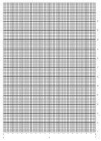

# Capítulo 4. Para su referencia
## Parte 9: Plantillas

**Contenido:**

* [Pantalla de texto; modo 0 (20 columnas)](#pantalla-de-texto-modo-0-20-columnas).
* [Pantalla de texto; modo 1 (40 columnas)](#pantalla-de-texto-modo-1-40-columnas).
* [Pantalla de texto; modo 2 (80 columnas)](#pantalla-de-texto-modo-2-80-columnas).
* [Envolventes de sonido/música](#envolventes-de-sonidomúsica).

***

### Pantalla de texto; modo 0 (20 columnas)

Descárgala  en PDF [aquí](pdf/c07-p09-i01.pdf).

### Pantalla de texto; modo 1 (40 columnas)

Descárgala  en PDF [aquí](pdf/c07-p09-i02.pdf).

### Pantalla de texto; modo 2 (80 columnas)

Descárgala  en PDF [aquí](pdf/c07-p09-i03.pdf).

### Envolventes de sonido/música

Descárgala  en PDF [aquí](pdf/c07-p09-i04.pdf).

***

&#9664; [Capítulo 7. Parte 8: Palabras reservadas de BASIC](7.08.-Palabras-reservadas-de-BASIC)   /  [Índice](0.03.-Contenido)  /   [Capítulo 7. Parte 10: Conexiones](7.10.-Conexiones) &#9654;