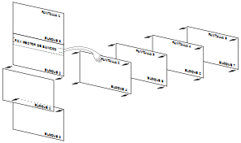

# Capítulo 8. Más sobre el gestor de bancos de memoria

## Parte 1: Almacenamiento de imágenes de pantalla

**Contenido:**

* [Ejemplos de transferencias de pantallas](#ejemplos-de-transferencias-de-pantallas).

***

El gestor de bancos puede "desconectar" el bloque 1 de RAM y poner en su lugar uno cualquiera de los cuatro bloques de 16K de que consta el segundo banco. La figura siguiente muestra en qué consiste esta conmutación. Observe que los cuatro bloques del segundo banco están todos en el mismo grupo de direcciones, de &4000 a &7FFF. El contenido del bloque 1 (normalmente ocupado por instrucciones de BASIC) no se pierde, sino que es restaurado cuando el gestor de bancos termina su trabajo. Además de las cinco conmutaciones de bancos ilustradas en la figura, hay otras tres posibles, pero sólo se las utiliza en CP/M.



<center>Conmutación de bancos por hardware</center>
El gestor de bancos dispone de dos órdenes externas con las que se pueden transferir pantallas completas de un bloque a otro; estas órdenes conmutan automáticamente los bloques 4 a 7 cuando es necesario y dejan restablecido el bloque 1.

La orden 

```
|SCREENSWAP,[<sección de pantalla>,]<número de pantalla>,<número de pantalla>
```

intercambia el contenido de dos bloques, mientras que

```
|SCREENCOPY,[<sección de pantalla>],<número de pantalla destino>,<número de pantalla fuente>
```

copia el contenido de un bloque en otro.

El parámetro opcional \<sección de pantalla\> hace que la transferencia de información se realice por tramos de 1/64 de pantalla (256 bytes del total de 16K). Así pues, el parámetro puede tener cualquier valor comprendido entre 0 y 63. Este método de operación es útil cuando se necesita mezclar alguna otra tarea con la de transferencia de pantallas. El tiempo de ejecución de un intercambio de pantallas es de aproximadamente 150/300 segundos (150 unidades de la variable **TIME**).

Los \<números de pantalla\> son números cualesquiera del margen de 1 a 5. (La pantalla 1 es la visible.) Las operaciones de copia e intercambio en las que interviene la pantalla 1 son mucho más rápidas que las otras. Tenga cuidado con el efecto de "desplazamiento vertical por hardware", que ya puede haber experimentado al trabajar con volcados de pantalla. Se debe procurar que todas las imágenes de pantalla se construyan (y visualicen) con la pantalla 1 en la misma posición de hardware. La posición más sencilla es la establecida por una orden **MODE**.

### Ejemplos de transferencias de pantallas

Cargue y ejecute el programa BANKMAN con la orden 

```basic
RUN "BANKMAN"
```

Escriba 

```basic
MODE 1
```

con lo que se borra la pantalla. Ahora escriba

```basic
' Esta es la pantalla original
|SCREENCOPY,3,1  'Pantalla original va a la memoria 3
CLS
```

La pantalla se ha vuelto a borrar. Escriba ahora 

```basic
' Esta es la pantalla intermedia
|SCREENCOPY,2,1 'Pantalla intermedia va a memoria 2
|SCREENSWAP,2,3 'Intercambia memorias 2 y 3
|SCREENCOPY,1,3 'Recupera pantalla intermedia desde memoria 3
|SCREENSWAP,2,3 'Recupera pantalla original desde memoria 2
```

Al final del [capítulo 9](9.02.-Más-en-concreto-sobre-el-CPC6128.md) damos un completo programa [diseñador de pantallas](9.02.-Más-en-concreto-sobre-el-CPC6128#gráficos-con-el-segundo-banco-de-64k-de-ram) que utiliza las funciones de transferencia de pantallas proporcionadas por el gestor de bancos.


