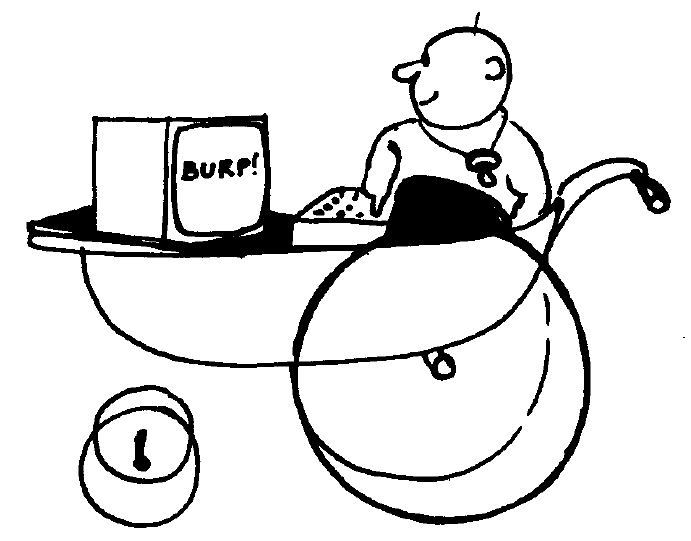
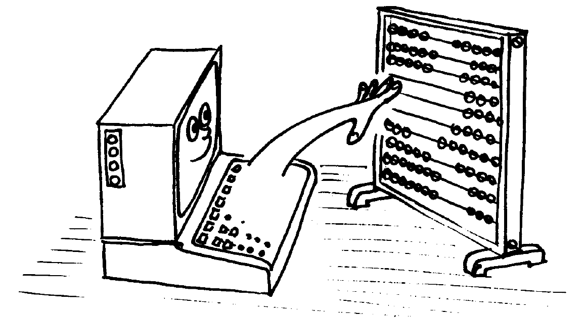
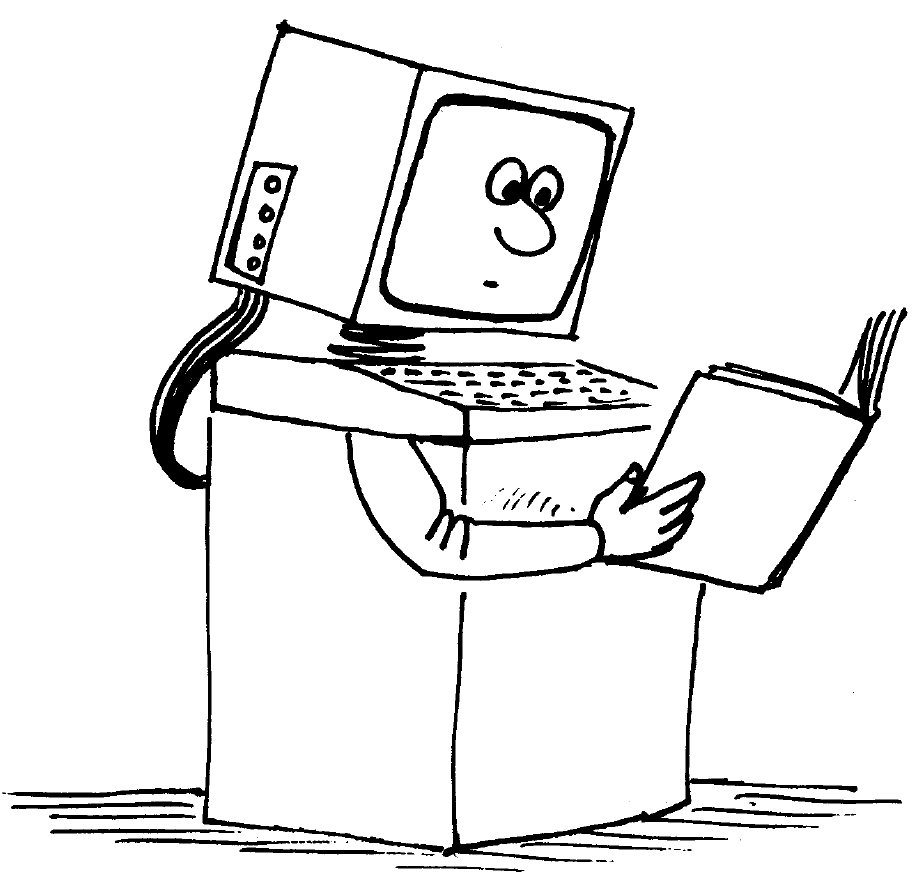

# Capítulo 9. Cuando usted guste

## Parte 1: En términos generales

**Contenido:**

* [¡Fulmina el bicho!](#fulmina-el-bicho).
* [¿Por qué es un ordenador mejor que otro?](#por-qué-es-un-ordenador-mejor-que-otro).
   * [Resolución de la pantalla: tamaño del menor elemento discernible.](#resolución-de-la-pantalla-tamaño-del-menor-elemento-discernible).
   * [El intérprete de BASIC](#el-intérprete-de-basic).
   * [Ampliabilidad](#ampliabilidad).
   * [Sonidos](#sonidos).
* [¿Por qué no puede?](#por-qué-no-puede).
* [Ese teclado me suena](#ese-teclado-me-suena).
* [¿Quién teme a la jerga?](#quién-teme-a-la-jerga).
* [Lo básico de BASIC](#lo-básico-de-basic).
* [Números](#números).
* [Bits y bytes](#bits-y-bytes).
* [Sin embargo](#sin-embargo).

***


### ¡Fulmina el bicho!

Aun cuando lo único que le interese de su CPC6128 sea disfrutar de los sofisticados juegos de ordenador que se venden en las tiendas, es posible que se pregunte qué tiene la máquina dentro, es decir, qué es eso del hardware.

Hardware es lo que usted puede coger y llevarse bajo el brazo (es un decir): la caja gris donde está el teclado, el monitor, los cables, etc. Más en general, todo lo que no sea específicamente software: programas, manuales e información grabada en cinta o en disco.

Ciertos aspectos del funcionamiento del ordenador están estrechamente ligados al hardware; por ejemplo, la imagen de color que usted puede ver en la pantalla. En cambio, es responsabilidad del software controlar el hardware para producir los caracteres y dibujos deseados. 

Es el hardware el que dirige el haz de electrones a la superficie electroluminiscente de que está recubierto el interior del tubo del televisor; el software aporta la organización y la inteligencia para decir al hardware cómo y cuándo debe hacerlo. Añade además el control de los tiempos y de las secuencias de acciones para que usted pueda ver la nave espacial despegando, o para algo tan mundano como que aparezca una letra en la pantalla cada vez que usted pulsa una tecla. 

### ¿Por qué es un ordenador mejor que otro?

El hardware sin el software es completamente inútil, y viceversa. El ordenador empieza a servir para algo cuando hardware y software se ponen de acuerdo para llevar a cabo sus cometidos. Hay algunas consideraciones básicas que se pueden tener en cuenta para valorar la calidad tanto de uno como del otro. 

Los puntos de referencia generalmente aceptados para los ordenadores personales son: 

#### Resolución de la pantalla: tamaño del menor elemento discernible

El concepto de resolución es una mezcla de diversos factores: número de colores disponibles para el programador, número de áreas discernibles en la pantalla (pixels) y número de caracteres de texto que caben en ella.

Usted puede comprobar que su CPC6128 es superior a este respecto a los otros ordenadores de su nivel de precio. 

#### El intérprete de BASIC

Prácticamente todos los ordenadores domésticos incluyen un intérprete de BASIC que permite al usuario crear programas con los que controlar el hardware. El lenguaje de programación que viene con la máquina, BASIC, no es más que un programa, pero un programa extremadamente complejo que ha evolucionado a lo largo de los años, desde que se "inventó" el BASIC en los Estados Unidos. El "Beginners" All-purpose Symbolic Instruction Code" (código de instrucciones simbólicas de uso general para principiantes) es el lenguaje de ordenador más ampliamente utilizado en el mundo entero; como todos los lenguajes, tiene sus dialectos locales.

La versión utilizada en el CPC6128 es una de las de mayor compatibilidad; puede ejecutar programas escritos para funcionar bajo control del sistema operativo de disco CP/M. Es una versión muy rápida de BASIC, lo que quiere decir que realiza los cálculos muy deprisa. A usted quizá no le parezca demasiado impresionante que un ordenador tarde 0.05 segundos en multiplicar 3 por 5 y escribir la respuesta, mientras que otro ordenador tarda 0.075 segundos en hacer lo mismo. Pero cuando se trata de dibujar gráficos en la pantalla, tarea que puede requerir millares de cálculos repetitivos, la diferencia entre 0.05 y 0.075 segundos es decisiva.

Usted oirá hablar frecuentemente de "códigos de máquina". El código de máquina es una forma de suministrar instrucciones directamente al microprocesador. La velocidad de ejecución es entre 5 y 15 veces mayor en código de máquina que en BASIC, pero el tiempo que se tarda en escribir un programa puede ser hasta 50 veces mayor en código de máquina que en BASIC.

El BASIC de Amstrad es de los más rápidos y completos que se pueden encontrar en ordenadores personales, e incorpora muchos recursos que ayudan al programador experto a superar parte de la lentitud inherente a todos los lenguajes de alto nivel para producir efectos visuales y sonoros sorprendentemente dinámicos. 

#### Ampliabilidad

Casi todos los ordenadores prestan atención a la necesidad de conectar periféricos tales como impresoras, joysticks y unidades de disco. Sin embargo, muchos de los más populares ordenadores domésticos necesitan interfaces externas para que se les pueda conectar una simple impresora o un joystick.

El comprador no siempre prevé las necesidades futuras, pero un ordenador que incorpore un interfaz para impresora o un conector para joystick puede ser más barato a la larga que otro por el que tenga que pagar menos en el momento de la adquisición.

El CPC6128 tiene incorporada una puerta de salida para impresora (tipo Centronics), una salida para segunda unidad de disco, una salida para cinta (con control de motor), un conector para dos joysticks, una salida de sonido estereofónico y una puerta de expansión a la que se puede conectar un interfaz serie (modelo RS232C de Amstrad), un modem, un sintetizador de voz (modelo SSA2 de Amstrad), un lápiz óptico, etc. 

#### Sonidos

Las características sonoras de un ordenador determinan si "suena a lata" o si puede producir una imitación aceptable de un instrumento musical electrónico. 

El CPC6128 está dotado de un generador de sonido de 3 canales y 8 octavas, que puede dar una calidad musical muy aceptable y permite el control completo de las envolventes de tono y de volumen. Además, el sonido se puede obtener en una configuración estereofónica, con canal izquierdo, canal derecho y canal común. 

Esto permite programar el sonido para coordinarlo con el movimiento de objetos por la pantalla. 

En último extremo, es usted quien tiene que decidir qué características le son más necesarias. Esperamos que las pruebe todas, para así aprovechar al máximo su ordenador. 

### ¿Por qué no puede?

Sabiendo lo poderosa que es la tecnología actual, los usuarios se preguntan frecuentemente por qué una máquina tan avanzada como el CPC6128 es incapaz de imitar las imágenes de un televisor de color. Por ejemplo, ¿por qué no puede un ordenador mostrar en la pantalla la imagen de una persona caminando con naturalidad? ¿Es que los ordenadores no son capaces de dar movimiento más que a unos burdos monigotes? 

La respuesta es fácil, aunque compleja. No crea usted que la pantalla de su ordenador puede tener la misma riqueza de detalles que la de un televisor. Los televisores funcionan con una información "analógica", que puede describir, con resolución casi ilimitada, todos los grados posibles de intensidad de todos los colores del espectro visible. En términos informáticos, esto representa que la "memoria" necesaria para almacenar una imagen de televisión es unas veinte veces mayor que la que se le dedica a un ordenador doméstico. 

Pero esto es sólo una parte del problema. Para dar movimiento a una imagen, hay que procesar toda esa información a gran velocidad (del orden de 50 veces por segundo). No es imposible, pero para ello se necesitan máquinas que cuestan unos cuantos miles de veces más que un ordenador doméstico, al menos en la actualidad. 

Hasta que el precio de la memoria de alta capacidad baje drásticamente (lo que ocurrirá algún día), los ordenadores pequeños tienen que arreglárselas con una memoria relativamente pequeña para controlar la pantalla, lo que representa menor resolución y movimientos más espásticos. Optimizando el hardware y el software se puede paliar considerablemente estas limitaciones, pero de momento tendremos que seguir conformándonos con imágenes torpes que ni siquiera llegan a parecerse a las de una película de dibujos animados de regular calidad. 

### Ese teclado me suena

¿Por qué no puedo sentarme ante el ordenador y escribir una sencilla página de texto?

No se deje engañar por el hecho de que el ordenador se parece a una máquina de escribir electrónica con pantalla. La pantalla no es una hoja de papel electrónico: es una "consola de órdenes", expresión técnica que quiere decir que es una vía de comunicación entre el usuario y el lenguaje de programación que está en la memoria de la máquina.

Mientras no se le mande otra cosa, el ordenador tratará de entender todo lo que se le comunique a través del teclado, pues supone que son instrucciones. Cuando usted pulsa **[RETURN]**, el ordenador examina lo tecleado; si no es inteligible para el BASIC residente, lo rechaza y emite el mensaje: 

```
Syntax error
```

Ahora bien, puede ocurrir que el programa actualmente presente en la memoria sea un procesador de textos; en tal caso usted podrá escribir las palabras que desee, pulsar **[RETURN]** y seguir escribiendo a sus anchas, exactamente igual que si el ordenador fuera una máquina de escribir que utilizara papel electrónico. Pero, para que esto sea posible, antes se debe haber cargado en la memoria un programa de proceso de textos. 

El ordenador parece combinar aparatos que nos resultan familiares de tanto verlos en casa y en la oficina, como son la pantalla y el teclado. Pero recuerde que la similitud normalmente es superficial y que el ordenador es una combinación de elementos con personalidad propia. 


### ¿Quién teme a la jerga?

Como ocurre con todas las ramas especializadas de la industria, la informática ha desarrollado una jerga propia para facilitar la comunicación de conceptos complejos que de otra forma requerirían muchas palabras de lenguaje ordinario. Esto no ocurre solamente en el campo de la alta tecnología; todos hemos topado con barreras de este tipo levantadas por los profesionales de distintas áreas. 

En el caso de la informática, la confusión se debe más a la forma de utilizar las palabras que a las palabras en sí. (Y en castellano, a la imposibilidad de traducir ciertas palabras inglesas o a que no nos tomamos la molestia de intentarlo.) Casi todos los que llegan a familiarizarse con la terminología de la informática se esfuerzan por utilizar las palabras de la forma más directa posible, con objeto de minimizar la dificultad de la comunicación. Pero no crea que el lenguaje informático es lo mismo que el lenguaje literario; la informática no es literatura, sino una ciencia precisa; aparte la sintaxis, la estructura de la comunicación en informática es directa y sencilla, y de ningún modo confusa o ambigua. Como no es literatura, la informática no ha necesitado desarrollar una asignatura de "comentario de textos" para analizar el significado exacto del significado de los programas.

Independientemente de si el significado de un programa es obvio o no lo es, hay muchos aspectos de la programación que se pueden calificar de embarullados o de elegantes; ahora que se está asentando el revuelo inicial causado por la aparición de los microordenadores, se está prestando mayor atención a los aspectos formales de la construcción de programas.

La informática está penetrando en las mentes de muchos jóvenes que valoran la precisión y la sencillez de las ideas y de la forma de comunicarlas. No hay demasiados niños que a los diez años sean ya abogados, pero sí muchos que a esa edad saben programar. 



### Lo básico de BASIC

Casi todos los ordenadores domésticos tienen incorporado el lenguaje BASIC, que hoy por hoy es lo más próximo al lenguaje ordinario. El nombre del lenguaje no implica ninguna limitación en cuanto a sus posibilidades; de hecho, se ha escrito programas extremadamente complejos y potentes en BASIC.

Sin embargo, es evidente que el nombre ha atraído a muchos principiantes, que esperaban encontrar en BASIC un buen punto de partida entre el laberinto de los lenguajes de programación; y esto ha contribuido en gran medida a su universalidad.

BASIC es un lenguaje informático que interpreta un reducido número de órdenes, como resultado de las cuales realiza operaciones con los datos según se va ejecutando el programa. A diferencia del vocabulario humano medio, que consta de entre 5000 y 8000 palabras (además de la conjugación de los verbos, plurales, diminutivos, etc.), BASIC tiene que arreglárselas con sólo un par de centenares. Los programas escritos en BASIC tienen que ajustarse a reglas muy estrictas en cuanto a la forma de utilizar esas palabras. La sintaxis es muy precisa; todo intento de comunicarse con el ordenador en lenguaje coloquial producirá el frío mensaje: 

```
Syntax error
```

Esto no representa una limitación seria, ya que BASIC está diseñado para trabajar con números. Las palabras son básicamente una generalización de las operaciones matemáticas elementales (+, -, etc.). El concepto más importante que tienen que asimilar los principiantes es que el ordenador sólo puede manejar datos numéricos. Es decir, la información que se envía a la CPU (unidad central de proceso) tiene que estar en forma numérica. 

### Números

Si empleáramos un ordenador para almacenar las obras completas de Shakespeare, en todo el sistema no encontraríamos ni una sola letra o palabra. Todo elemento de información debe ser convertido a número antes de que el ordenador pueda reconocerlo y manipularlo. 

BASIC interpreta las palabras como si fueran números; para procesarlas, el ordenador no dispone de más medios que la suma, la resta y la lógica de Boole, con la cual puede hacer comparaciones y seleccionar atributos; en otras palabras, averiguar si un número es menor o igual que otro, o realizar determinada tarea si un número cumple cierta condición. 

A través del programa, el ordenador desmenuza todas las tareas en sus componentes más elementales. 



Si todo esto le parece farragoso, está en lo cierto. Ha descubierto la primera y más importante verdad de la informática. Un ordenador es una herramienta que sirve para realizar tareas elementales y repetitivas a gran velocidad y con precisión absoluta. Así, BASIC interpreta las instrucciones que se le dan por medio del programa y las traduce al lenguaje que la CPU (unidad central de proceso) puede entender. La lógica del ordenador sólo distingue dos estados: sí y no; en notación binaria, 1 y 0; en notación de Boole, "verdadero" y "falso". No hay estados intermedios del tipo "quizá". 

El proceso de conmutación entre esos dos estados es la esencia del término "digital". En la naturaleza casi todos los procesos evolucionan gradualmente de un estado "estable" a otro. En cambio, en la situación digital ideal, la transición de un estado a otro es instantánea. Sin embargo, las leyes de la física de semiconductores imponen un pequeño retardo, el retardo de propagación, que es el causante del tiempo que tarda el ordenador en procesar la información antes de dar la respuesta. 

En todo caso, el ordenador tiene que esperar hasta que concluya una tarea antes de poder abordar la siguiente, lo que representa que siempre se le impone un retardo artificial. El proceso digital es "blanco" o "negro", y las fases de transición por los diversos grados de "gris" no tienen ninguna importancia. En cambio, los procesos analógicos se realizan precisamente a través de esas fases de "gris".

Si la respuesta final sólo puede ser 0 o 1, no es posible que el resultado sea "casi" correcto. El hecho de que los ordenadores cometan errores en ocasiones se debe a la limitación del tamaño de los números que pueden procesar; los números con demasiados dígitos tienen que ser "comprimidos" para que encajen en el espacio disponible, lo que conduce a errores de redondeo. 

En un mundo en el que sólo existen los dígitos 0 y 1, ¿cómo se cuenta más allá de 1? 

#### Bits y bytes

Estamos habituados a entender los números solamente cuando están expresados en el sistema decimal, en el que el punto de referencia es el número 10 y en el que se dispone de 10 dígitos (del 0 al 9) para representar los números. El sistema binario es conceptualmente análogo al decimal, pero con sólo dos dígitos; las unidades con las que opera este sistema son los denominados *bits* (forma contraída de *BInary digiT*, dígito binario). 

La relación entre bits y números decimales es sencilla y vamos a estudiarla. 

Es habitual declarar el máximo número de bits que vamos a usar para representar los números, y añadir ceros por la izquierda para completar la expresión. Por ejemplo, el número decimal 7 se convierte en el binario 

* 00111

en notación de 5 bits. 

En el sistema binario, los dígitos se pueden considerar como indicadores dispuestos en columnas para especificar si una determinada potencia de 2 está presente o no lo está: 


de modo que las columnas tienen el siguiente aspecto:


Para abreviar la terminología al hablar de información binaria se introduce el concepto de "byte", que es una sucesión de 8 bits. El mayor número que se puede representar con un byte es 11111111 (binario) o 255 (decimal). Si contamos también el 00000000, resulta un total de 256 números distintos, que son datos perfectamente válidos para el ordenador.

Los ordenadores prefieren manejar los bits en grupos de 8. El número 256 es demasiado pequeño, y por eso, para poder controlar la memoria, se utilizan dos bytes que se interpretan en forma matricial. Cada posición de memoria tiene una dirección vertical y otra horizontal, y entre las dos caracterizan sin ambigüedad la posición. Por ejemplo, la siguiente matriz 

|       |  0   |  1   |  2   |  3   |  4   |  5   |  6   |  7   |  8   |  9   |
| :---: | :--: | :--: | :--: | :--: | :--: | :--: | :--: | :--: | :--: | :--: |
| **0** |      |      |      |      |      |      |      |      |      |      |
| **1** |      |      |      |      |      |      |      |      |      |      |
| **2** |      |      |      |      |      |      |      |      |      |      |
| **3** |      |      |      |      |      |      |      |      |      |      |
| **4** |      |      |      |      |      |      |      |      |      |      |
| **5** |      |      |      |  1   |      |  1   |      |      |      |      |
| **6** |      |      |      |      |      |      |      |      |      |      |
| **7** |      |      |      |      |      |      |      |      |      |      |
| **8** |      |      |      |      |      |      |      |      |      |      |
| **9** |      |      |      |      |      |      |      |      |      |      |

puede caracterizar hasta 10x10 elementos de información utilizando números de dirección comprendidos entre 0 y 9. El elemento almacenado en la posición 3,5 es un "1", lo mismo que el que está en la posición 5,5.

Análogamente, una matriz binaria de 256x256 puede caracterizar 65536 posiciones utilizando direcciones de 8 bits para los ejes vertical y horizontal de la matriz. Nuestros elementos iniciales, "0" y "1", han progresado hasta ser capaces de identificar 65536 elementos diferentes. 

El siguiente nivel de abreviatura en terminología binaria es el K, que representa 1024 bytes. El número 1024 es la potencia de 2 más próxima a nuestro "kilo" (1000), y explica por qué se dice que un ordenador es de 64K cuando en realidad tiene una memoria de 65536 bytes (64x1024). 

Afortunadamente, el intérprete de BASIC se encarga de todas estas conversiones. Es perfectamente posible llegar a ser un programador aunque no se domine el sistema binario. No obstante, unos conocimientos del sistema binario pueden ayudar a desenmascarar la magia de ciertos números clave que inevitablemente nos encontramos en informática. 

Vale la pena dedicar algún tiempo a entender el sistema binario y a comprender el por qué de números tales como el 255 o el 1024, pues parece evidente que estos números seguirán siendo el fundamento de la informática, al menos en el futuro previsible. La fiabilidad y sencillez que proporciona el sistema binario se seguirá imponiendo a la complejidad que implicaría cualquier otro sistema de numeración. 

#### Sin embargo

Por sencilla y elegante que sea, la notación binaria induce a confusión a los humanos, porque no somos capaces de leer de un golpe de vista los números binarios. Hay algunos otros sistemas de numeración que los programadores utilizan con mayor facilidad. Un sistema muy utilizado en microordenadores es el hexadecimal (HEX). Su base es el número 16. La correspondencia entre dígitos decimales y hexadecimales es la siguiente: 


El sistema hexadecimal puede dividir los 8 bits de un byte en dos bloques de 4 bits, ya que 15 es un número de 4 bits: 1111 en binario. El primer bloque indica el número de unidades completas de "15"; el segundo bloque indica el "resto". Y aquí es donde empieza a aparecer la elegancia de los sistemas binario y hexadecimal. A continuación damos una tabla de conversión entre los tres sistemas para los primeros números: 

| Decimal | Binario | Hexadecimal |
| ------: | ------- | :---------: |
|    0    | 0       |      0      |
|    1    | 1       |      1      |
|    2    | 10      |      2      |
|    3    | 11      |      3      |
|    4    | 100     |      4      |
|    5    | 101     |      5      |
|    6    | 110     |      6      |
|    7    | 111     |      7      |
|    8    | 1000    |      8      |
|    9    | 1001    |      9      |
|   10    | 1010    |      A      |
|   11    | 1011    |      B      |
|   12    | 1100    |      C      |
|   13    | 1101    |      D      |
|   14    | 1110    |      E      |
|   15    | 1111    |      F      |
|   16    | 10000   |     10      |

Un número de 8 bits tal como el 11010110 (&D6 hex) puede ser subdividido en dos de 4 bits. A lo largo de todo este manual indicamos los números hexadecimales precediéndolos del signo &. El sistema hexadecimal es el más utilizado por los programadores que trabajan en ensamblador. El lenguaje ensamblador es la etapa más cercana a código de máquina a la que llegan normalmente los programadores; permite expresar las instrucciones en "códigos nemotécnicos", que son algo más inteligibles que los códigos de máquina. 

Para convertir un número hexadecimal en binario, lo primero que hay que hacer es observar el primer dígito, para ver cuántos grupos de "16" hay en el número, multiplicar por 16 y luego sumar al resultado el valor del segundo dígito. Así pues, no se deje llevar por la tentación de pensar que &D6 es 13+6, ni 136, porque en realidad es (13x16)+(6)=214.

El proceso es el mismo que seguimos cuando leemos un número decimal: 89=(8x10)+9. Lo que ocurre es que nos resulta mucho más fácil multiplicar por 10 que por 16; es una cuestión de práctica. 

Si usted ha conseguido llegar hasta aquí sin estar demasiado confuso, puede decir que está en el buen camino para llegar a entender los principios básicos del ordenador. Quizá se pregunte para qué nos metemos en todas estas complicaciones, y tiene razón. Un ordenador es un aparato que maneja ideas y conceptos muy sencillos; lo que tiene de especial es que realiza esas operaciones a una velocidad muy grande (millones de veces por segundo) y que tiene una enorme capacidad para recordar los datos, tanto los que se le han suministrado como los resultados intermedios de los muchos miles de sumas que realiza antes de poder dar la respuesta final. 

Si desea seguir estudiando la teoría de los ordenadores, sepa que hay miles de libros dedicados a estos temas. Algunos no le aclararán en absoluto las ideas, sino todo lo contrario, pero otros en cambio le guiarán en el descubrimiento de la sencillez y las relaciones fundamentales que existen entre los sistemas de numeración y le ayudarán a comprender la forma en que el ordenador los maneja. 



***

&#9664; [Capítulo 9. Cuando usted guste](9.00.-Capítulo-9.-Cuando-usted-guste.md)   /  [Índice](0.03.-Contenido.md)  /   [Capítulo 9. Parte 2: Más en concreto sobre el CPC6128](9.02.-Más-en-concreto-sobre-el-CPC6128.md) &#9654;